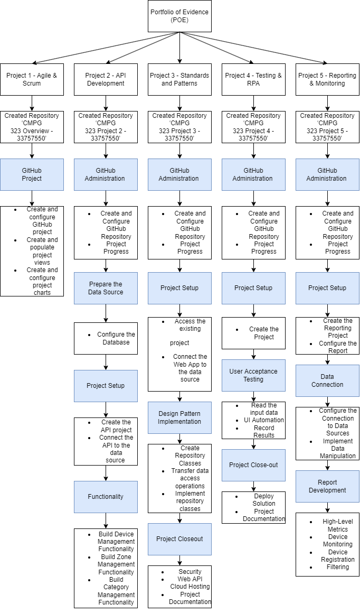

# CMPG-323-Overview---33757550
Project 1- Agile &amp; Scrum

## Repositories

Project 1 - Agile & Scrum: 'CMPG 323 Overview - 33757550' will be created and used.

Project 2 - API Development: ‘CMPG 323 Project 2 - 33757550' will be created and used.

Project 3 - Standards & Patterns: ‘CMPG 323 Project 3 - 33757550' will be created and used.

Project 4 - Testing & RPA: ‘CMPG 323 Project 4 - 33757550' will be created and used.

Project 5 - Reporting & Monitoring: ‘CMPG 323 Project 5 - 33757550' will be created and used.

### Diagram
The diagram explaining project and repository context and how they are integrated. The blocks in blue are the feutures or main aspects within the projects and everything underneath a blue block is extra information about what needs to happen in the projects. At the top of the diagram is the Portfolio of Evidence(POE) as it is what I plan on completing with all off these projects that are integrated into one big Portfolio of Evidence.

#### Branching Strategy

For all projects I have decided to use Git flow branching strategy as I will be able to isolate my work into different types of branches. Each project will automatically have a main branch. There are many of the projects that will also contain a develop branch and maybe even a feature branch.

##### .gitignore file

The .gitignore file is a plain text file that will contain patterns of files/directories to ignore within each project. Only files that are put into the .gitignore file will be ignored. Within each project there will be certain files that need to be ignored and that is why the .gitignore file will be used.

###### Storage of credentials and sensitive information

It is important to ensure that credentials and sensitive information be stored properly so as to ensure that no one that is not authorized can access this information.
To protect this information we can implement a safety precaution such as a username and password that needs to be put in correctly in order for credentials and sensitive information to become available.
<<<<<<< HEAD

####### Project 2 - API Development

Update on project 2 

In this project we have created an API to execute certain functions. GET, POST, PATCH and DELETE methods are created. The stakeholdes will only get use of the data as it is an API. The stakeholders can use this data to help them with decision making. \
=======
>>>>>>> 8a0bec62fed677b62ebb5f0f0c758a7f9ce3f998
